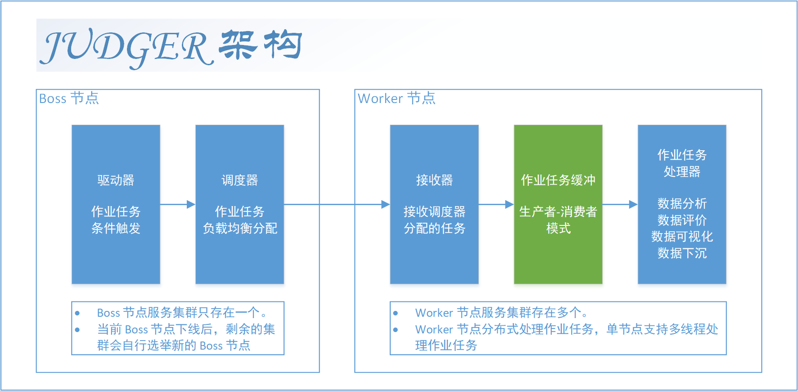

# judge

Judge 是一款开箱即用的用于数据评价的调度框架与算法集合，能够对各种数据进行评价，并分布式调度数据评价任务。

数据评价是一个较为抽象的概念，但在实际应用中有着广泛的应用，例如以下场景：

- 观察股市数据，并在合适的时机发出买入或卖出的信号。
- 监控磁盘使用率，若磁盘使用率过高，则发出告警。
- 收集机械设备的传感器数据，预测机械设备的故障。

在上述例子中，虽然场景各不相同，但都可以将其抽象为以下过程：

```text
收集采集 -> 数据分析 -> 分析结果评价 -> 评价结果处理
```

Judge 服务将上述过程中的 `数据分析`、`分析结果评价` 两个环节进行封装，并将生成的评价结果下沉至后续的处理环节中。
Judge 服务可以用于搭建规则引擎、数据质量评价系统、数据监控系统等、预测性维护系统等。

Judge 服务以 `部件(Section)` 为核心，可以维护大量部件，其中对每个部件可以分别维护数据分析规则、分析结果评价规则、数据下沉规则。

Judge 服务为 `数据分析`、`分析结果评价` 等作业逻辑封装了标准的接口，并维护了这些接口的调用逻辑，用户只需实现这些接口，
即可将其算法逻辑接入 Judge 服务中。
Judge 服务内置了（或者将要内置）多种常用的数据分析算法与评价算法，用户可以直接使用这些算法；
同时，Judge 服务也提供了 SPI 机制，用户可以将其自定义的算法封装为 jar 包并放置在插件目录下， 即可被 Judge 服务自动发现并使用。

对于较大数量的部件，或是耗时较长的数据分析算法，Judge 服务可以将其负载均衡至多个工作节点上进行处理， 
其可以在很大的数据量下，仍然保持较低的延迟与较高的吞吐。

---

## 特性

- 实现数据评价的调度框架，内置多种接口实现数据评价的标准化调度逻辑。
- 基于驱动器接口，进行数据评价作业的条件触发，并使用 boss-worker 模式对数据评价作业进行分布式调度。
- 在作业中进行数据分析与多维度评价（一个作业可以包含多个评价结果），作业任务进度可视，并且支持任务事件的记录。
- 使用可视化机制，对数据分析结果与评价结果进行可视化处理，以便于使用者生成分析报表、分析报告等可视化内容。
- 对作业任务执行过程中产生的数据进行存储与管理，并在任务结束前使用下沉器对数据进行下沉，以便下游系统评价结果处理，形成闭环。
- 内置多种常用的数据分析算法与评价算法，支持用户自定义算法。
- 提供 Telqos 运维平台，能够在没有 GUI 的环境下使用本服务的功能。
- 支持主流关系型数据库（基于 Hibernate）。
- 支持分布式部署。

## 系统架构

Judge 服务的系统架构如下图所示：



## 文档

该项目的文档位于 [docs](./docs) 目录下，包括：

### wiki

wiki 为项目的开发人员为本项目编写的详细文档，包含不同语言的版本，主要入口为：

1. [简介](docs/wiki/zh-CN/Introduction.md) - 镜像的 `README.md`，与本文件内容基本相同。
2. [目录](docs/wiki/zh-CN/Contents.md) - 文档目录。

## 运行截图

Telnet 运维平台 banner：


Telnet 运维平台指令合集：


消费者服务状态：


